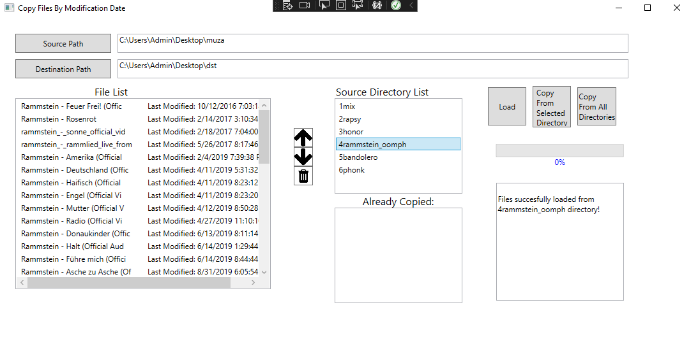
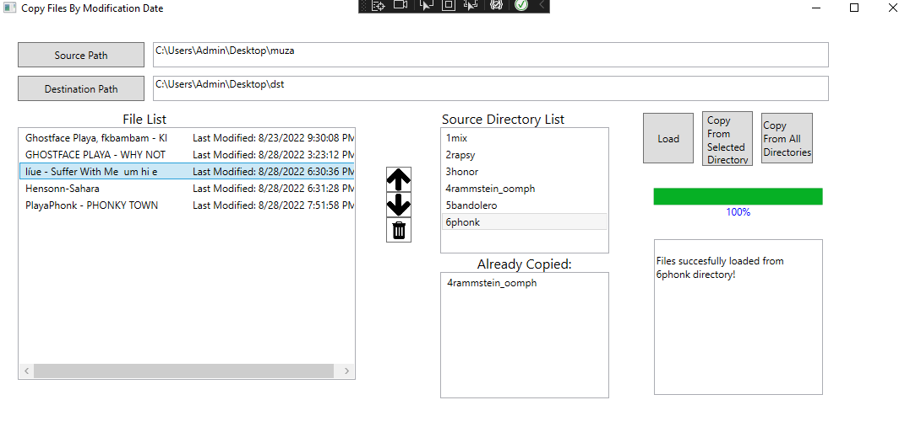
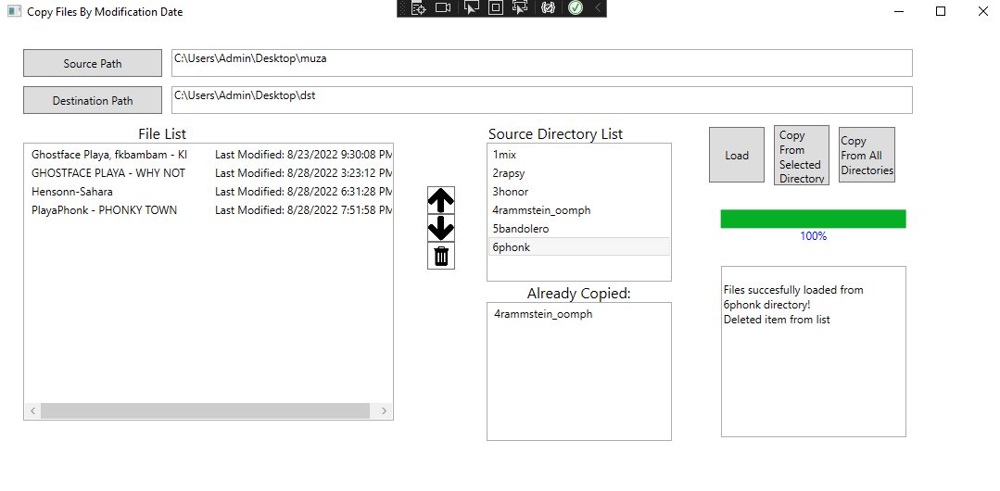

## Copy Files By Modification Date Application ##

The application is used to copy mp3 files with the order depending on the date of the last modification of the file(Windows copies files based on the name by default, and I guess this cannot be changed). I personally use the application to copy music to a flash drive used in a car - I have a car with an old radio that requires the use of an FM transmitter to play mp3's from the flash drive where the order in which the file was saved affects the playback order, and I want the newest songs to be at the very end of the folder, so I created this application to improve the sorting of music :)
The application displays a list containing the song title and the date it was last modified based on the files in the source files folder. It allows you to remove a file from the list of files to be copied. When copying, the progress bar increases with the number of copied files. The GUI look may not be the prettiest, but what I cared most about was that the program does its job.

### Screenshots ###
| Images  | Images |
| ------------- | ------------- |
|   |   |
|   |   |